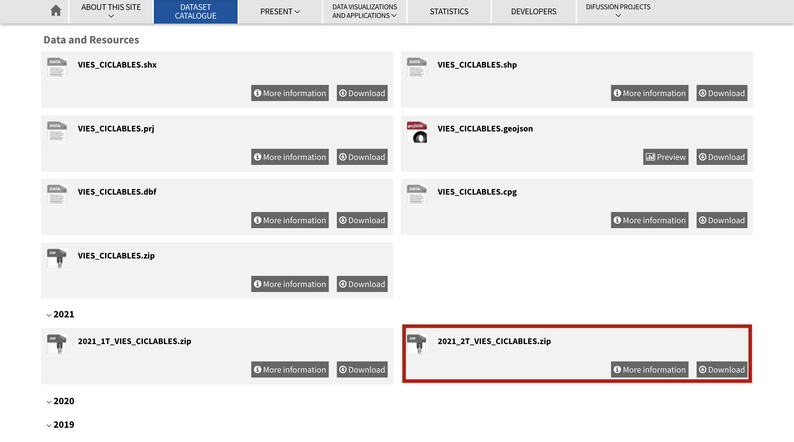
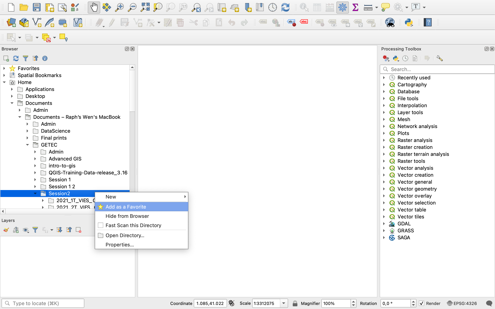
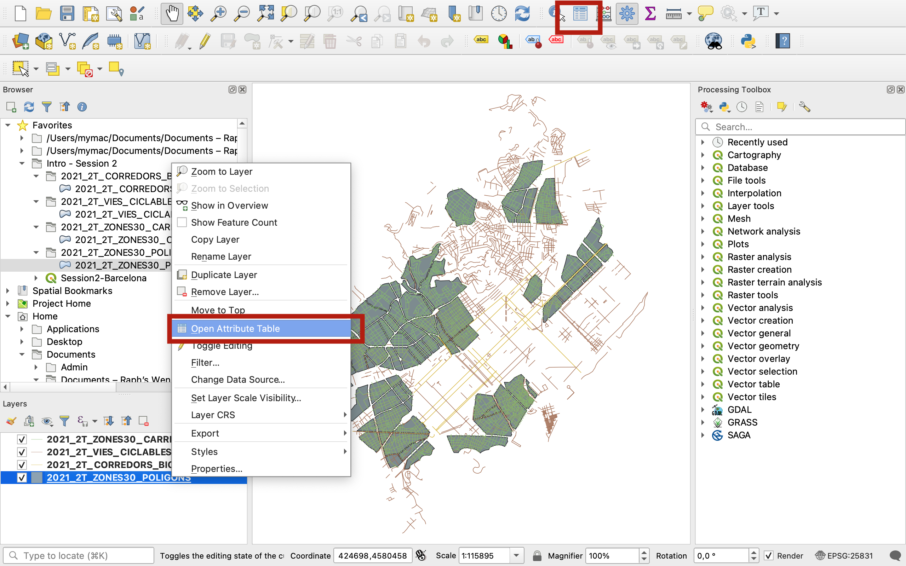

# Session 2: Sourcing and loading data into GIS

**Introduction to GIS  ·  Sciences Po Urban School, GETEC Masters  ·  Fall semester 2021-2022**

Lecturer: Raphaëlle Roffo

&nbsp; 

## I. Session 2 Overview

**Download the [slides](https://github.com/raphaelleroffo/intro-to-gis/raw/main/Session2/Intro%20to%20GIS%20-%20session%202.pdf)**

- *Last week recap*
- *Common GIS data formats*
- *Data sourcing*
- *Looking at data in kepler.gl*

&nbsp; 

## II. Tutorial

### Goals:

- Downloading data from an open data portal
- Setting up a QGIS project 
- Loading data into QGIS
- Saving vector data to a different format

### Data:

In this session we'll be downloading data from an open data portal. If you're running into issues, you can also download the data directly [here](https://github.com/raphaelleroffo/intro-to-gis/raw/main/Session2/Session2-Barcelona-data.gpkg).

&nbsp; 

## III. Downloading data from the Barcelona open data portal

Today we'll look at the city of Barcelona and its green mobility infrastructure. Luckily, an open data portal is available for you to search for data. Go to https://opendata-ajuntament.barcelona.cat/data/en/dataset .

On the side panel, you can select the data formats you're interested in. Here, these could be SHP (shapefiles), GeoJSON and GPKG (geopackages). However there is a bug on this portal as you can't select multiple formats at once ; if you select GeoJSON and SHP it will look for datasets that have both GeoJSON *and* SHP formats available. Instead, you have to look at each format one by one. In this tutorial we'll stick to SHP as it's the most widely available format (23 datasets available) and in fact datasets available as GeoJSON are also available as SHP.

Now you see a list of various datasets. We will be interested in datasets related to cycling paths. Before you start downloading anything, make sure you create in your Documents a dedicated folder where you'll save all your downloads. You can call it `Session2`. Note that QGIS can get "cranky" if the folder sits on a Dropbox or some kind of cloud-based drive. Please choose a *local* location on your computer.

&nbsp; 

**These are the datasets we will be working with:**

- **Zones 30** (cars limited to 30km/h speed) https://opendata-ajuntament.barcelona.cat/data/en/dataset/zones30-carrers 
  
  

  *If you scroll all the way down, you 'll see a set of information; this is your metadata. It tells you about the characteristics of this dataset:*

  

  **/!\ Now, BE VERY CAREFUL! On most platforms, downloading a shapefile will lead to a download of a zip file that contain 4 files:  `*.shp`, `*.dbs`, `*.shx` and `*.prj`. However, on this data portal it's not the case and chosing to download the `*.shp` file will only download that single file. Note that this file would be unusable on its own! So make sure you download the `*.zip` file and keep everything in that file.**
  
  *We'll actually download both the 2021_2T_ZONES30_CARRERS Zip file, in which the Zone 30 streets are represented as lines, and the 2021_2T_ZONES30_POLIGONS Zip file, where they're grouped in areas (polygons):*
  
  
  

&nbsp; 

- **Cycle paths** : https://opendata-ajuntament.barcelona.cat/data/en/dataset/vies-ciclables
  
  *Download the 2021_2T zip file:*

  

- **Bike corridors** https://opendata-ajuntament.barcelona.cat/data/en/dataset/corredors-bici-bcn
  
  *Download the zip file for T2.*
  
  
  
  *Note that when GeoJSON is available, you can preview the layer on a webmap:*
  
  

Once all of these files are downloaded, make sure you **unzip everything** before you move on to the next step. QGIS does not understand zip files and is not able to unzip them for you.

Now equipped with these 4 unzipped layers in your `Session2` folder, you are ready to open QGIS!

&nbsp; 

## IV. Setting up your QGIS project

Start a new blank project.
In your browser panel, Hote to the location of your `Session2` folder. Because it's usually hidden in successive folders, I like to add the location as favourite.

You can then rename the folder path to a simpler name such as "Intro Session 2". You can easily remove favourites from this right click menu.

Next, and before you start doing anything else, save your project file. 

Navigate to your `Session2` folder and save the file using the default extension: `*.qgz`. I called mine `Session2-Barcelona`. Click Save.

/!\ Now, here is a very important point: **A QGZ file alone does NOT contain any data!** Rather, the QGZ file contains the "recipe" for processing the data: in what order to display the layers, what symbology to apply, in what CRS you're working, the basemap you're using etc. In order for this recipe to work, you need to give QGIS the "ingredients" (= the data), or rather: the location where QGIS can "shop" for those ingredients (= a path to the location of the data on your computer). This is why **it's a good practice to save your QGZ file in the same folder as your data.** More on that in section 5.

&nbsp; 

## V. Loading data into your project

Now that you have set up your project nicely, it's time to load data.

From your `Intro - Session 2` folder in your **Browser** Favourites, unfold the folders and drag and drop all the layers (with the little blue blob symbol) onto your map canvas area. This symbol means that these are vector layers. Note that you can also load vector layers from the `Data Sources manager` icon in your toolbar or from your top menu : `Layer` > `Add layer` > `Add vector layer`

You will notice that four layers have now appeared in your **Layers** panel.

&nbsp; 

**Layer visibility**

By default, QGIS applies random colours to the layers.
Try drag and dropping layers to change their order in the Layers menu. By dragging the `Zone30_Polygons` layer to the bottom of the list, I have now also moved that polygon layer under the three others on my map canvas. This is why we call these "Layers"; they're one visual representation of an existing dataset. Note that you can duplicate a layer or delete a layer from this menu without affecting the source dataset that sits on your computer folder.

You can also play with unticking the layers to make them disappear from the map canvas. By clicking on the eye icon you'll also be able to control the visibility of your layers. Note that to select multiple layers at once you can use Ctrl or Shift, just like in your regular file browser.

&nbsp; 

**CRS**

Note that because you dragged data onto your canvas that has been georeferenced in the Coordinate Reference System that best suits Barcelona, all 4 layers come in EPSG:25831 by default. Once you dropped the first layer onto your canvas, the Coordinate Reference System of your map canvas automatically set itself to EPSG:25831 too (you can click on the "globe with a hat" symbol to see this menu appear):

&nbsp; 

**Attribute Table**

We will get back to symbology next week but for now, have a brief look at the attribute table of one of your layers, for instance the polygon layer, by right clicking on it and selecting `Open Attribute Table`, or clicking the icon in your toolbar while the layer is selected in your Layers panel. You'll see a table appear, which contains the attribute data for your Zones 30 Areas.

More on that next week when we work with the attribute table and perform table joins, selections, etc.

&nbsp; 

## VI. Exporting data / Saving in a different format and different CRS

Let's imagine you want to export data in GeoJSON to play with it in kepler.gl ([Kepler only lets you load CSV of GeoJSON, in WGS84](https://docs.kepler.gl/docs/user-guides/b-kepler-gl-workflow/a-add-data-to-the-map#geojson)).

**Leave your CRS as it is for now**; the conversion will happen as we export a copy of your dataset. Now, right click on your polygon layer > `Export` > `Save features as...`

&nbsp; 

Select GeoJSON as the format. The second field to fill is the File Name. **Careful! Here QGIS needs a full path actually, so you have to click on the three dots to open up your explorer!** (it's a common beginner error to only write the name and get an error message here). Navigate to your `Session2` folder and name this layer `Zone30Areas`.

Set the CRS to Default: EPSG:4326 WGS84 (you may need to click on little earth with a hat symbol if it's not already available from your dropdown menu):

Press OK. The new layer is automatically added onto your map canvas, and is now also saved in your directory. Please now remove this new layer from your layer list because we won't need it here. Select it (in blue) and then click the "white page and forbidden sign" icon:

Finally, you may try and load it into [kepler.gl](https://kepler.gl/demo)

&nbsp; 

## VII. Saving all your data as *.gpkg

Geopackages are now the gold standard for saving and sharing your data in a clean way. To understand why, let's go back to our earlier point on the fact that `*.qgz` files don't actually contain any data.

&nbsp; 

**7.1. Why use geopackages?**

You have currently built a map of Barcelona with 4 layers in a project called `Session2-Barcelona.qgz`. If you save your project (click the save icon) and close QGIS, then reopen your file, you will be back to where you left. However, if in the meantime you move your data to a different location on your computer, the next time you open this `Session2-Barcelona.qgz` project you will get the infamous "invalid layer" error message. This means that as QGIS is trying to execute the recipe written in your `Session2-Barcelona.qgz` file, it tried to gather the data (get ingredients) from the location where the data was when you last saved that project (the shop listed in the recipe). But because you removed your data from that folder, QGIS can no longer find it and therefore can't execute the recipe to display your map project properly. Sometimes it's only one layer that was misplaced so the error only applies to one of several layers and you can just manually add the layer back onto your map project again. But overall you should absolutely try and avoid these situations, especially if you're working with other people and you have to share your QGIS project.

In order to avoid these really annoying errors, there is now a very clean way of making sure all your data *and* the recipe sit in a same file: using geopackages.

&nbsp; 

**7.2. Creating a geopackage**

We start with one layer, for instance the `Zones30_Carrers`. First, right click on that layer > `Export` > `Save features as...`. In your menu, select the Geopackage format. For the name, again click on the three dots to navigate to your `Session2` folder. Give it a name that's descriptive of your entire project, not just that specific layer, for example `Session2-Barcelona-data`. This file will be home to a copy of the 4 datasets you're working with.

For the `Layer name`, QGIS will automatically suggest using `Session2-Barcelona-data`. Replace it by a descriptive name such as `Zone30-streets`. The CRS can remain the same. Ignore all other settings and press OK.

A new layer is now loaded onto your canvas and layer list, and a green message may have briefly appeared on top of your map canavs to signal that the export was successful. Look at your Browser: your geopackage file has now appeared, with a database icon (you can refresh the browser if it doesnt show yet). Click the arrow to unfod the geopackage and see its content:

&nbsp; 

**7.3. Adding data to an existing geopackage**

You now have an existing geopackage you can save additional layers into. In your `Layers` panel, right click on your `Zones30-Poligon` layer > `Export` > `Save features as...`. Use the `Geopackage` Format, then click on the three dots next to `File Name` to navigate to your `Session2` folder. There, click on your `Session2-Barcelona-data.gpkg` geopackage file. It may be grayed out but that's ok. You may notice the presence of a `Session2-Barcelona-data.gpkg-shm` and a `Session2-Barcelona-data.gpkg-wal` file as well; don't worry about those and don't delete them either; they are temporary files that appear while you are working on the geopackage in QGIS. When you close the software they will disappear from your folder.

You will get this error message. Don't worry about it, and click `Replace`:

Give the Layer a descriptive name such as `Zones30-areas`, keep every other setting and press `OK`.

You now have a new layer onto your canvas, your `Layers` panel AND your geopackage file. You can hit refresh in your `Browser` panel and unfold the geopackage icon to see your two layers:

Repeat the whole **5.3.** steps with the two remaining layers to add the cycling lanes and cycling corridors to your geopackage.

&nbsp; 

**7.4. Wrapping up**

Now that you have your four layers safely stored in your `Session2-Barcelona-data.gpkg` file, you can remove the old layers that link to the shapefiles using the `Remove layer/group` icon in your `Layers` panel. Press the `Save` icon in your toolbar to save the modifications you made to the `Session2-Barcelona.qgz` project file.

Now, a final trick! In fact you can use a geopackage to even save the project itself, in otehr words to replace your `*.qgz` file! You don't *have* to do it that way but it goes one extra step furtehr in packaging your entire project in a single file and minimizing risks of loss. Go to your top menu, `Project` > `Save to` > `Geopackage...`:

Use the three dots to navigate to your `Session2` folder and to select your `Session2-Barcelona-data.gpkg` file.

Give your project a name such as `Barcelona`, press `OK`, and voilà !

Now to test that everything was saved properly, press the white page to create a new blank project. Refresh your browser, and open your geopackage. Inside, you can now see a `Barcelona` file with a like QGIS icon. Double-click it:

You have now reopened your project file, complete with all the layers and the same symbology taht was previously applied. **Congrats! This concludes today's tutorial!**

If you have had difficulties, the final result, packaged in the `Session2-Barcelona-data.gpkg` geopackage, is available for your to download on the GitHub `Session2` folder.

&nbsp; 

## VIII. Reminder: QGIS Documentation
The QGIS documentation is available at this address: https://qgis.org/en/docs/index.html

**Please note:**

- This course is taught in English but some of you will have a version of QGIS installed that's in a different language. You can overwrite the language of your OS to use QGIS in English by going into `Preferences` > `Options` > `General` > `Override system locale` and select `English`.
  
    
   
- If you are trying to understand how a function translates into that language, at any time when navigating the documentation you can change the language of the page directly in the url (by replacing `/en/` by `/fr/` for French, or `/es/` for Spanish, `/zh-Hans/` for Mandarin Chinese etc.): For instance to go from English: https://docs.qgis.org/3.16/en/docs/user_manual/introduction/qgis_gui.html to French: https://docs.qgis.org/3.16/fr/docs/user_manual/introduction/qgis_gui.html

&nbsp; 

- Similarly, you might have a version installed that is not 3.16 ; you can also edit the version directly in the URL to match the release you're using, by changing `/3.16/` . For instance from QGIS version 3.16 https://docs.qgis.org/3.16/en/docs/user_manual/introduction/qgis_gui.html to QGIS version 2.18 https://docs.qgis.org/2.18/en/docs/user_manual/introduction/qgis_gui.html 

&nbsp; 

&nbsp; 

### **[Next Tutorial >](https://raphaelleroffo.github.io/intro-to-gis/intro-tutorial3.html)**

### **[Back to the syllabus >](https://raphaelleroffo.github.io/intro-to-gis/index.html)**