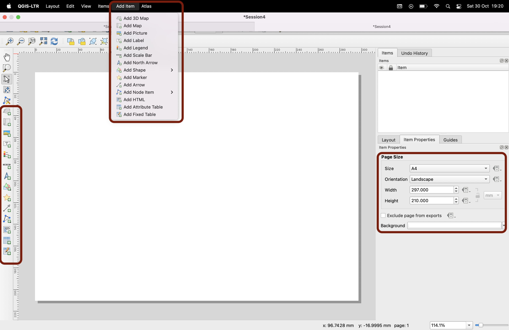
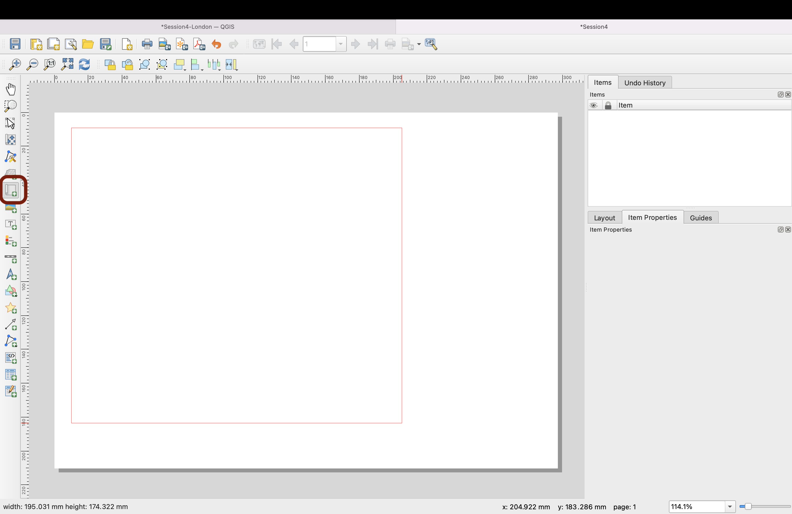

# Session 5: Choropleths & Vector geoprocessing

**Introduction to GIS  ·  Sciences Po Urban School, GETEC Masters  ·  Fall semester 2021-2022**

Lecturer: Raphaëlle Roffo

&nbsp; 

## I. Session 5 Overview

**Download the [slides](https://github.com/raphaelleroffo/intro-to-gis/raw/main/Session5/Intro%20to%20GIS%20-%20session%205.pdf)**

- *Use cases; why may you need to buffer, clip, intersect?*
- *"Crossing" multiple layers: common geoprocessing tools*
- *Walk-through common mistakes and data errors*

&nbsp; 

## II. Tutorial

### Goals:

- Building a choropleth
- Defining relevant class breaks
- Running simple geoprocessing tools
- Adding map layout elements (legend, title, etc.) using the Print Layout Composer
- Exporting a map as an image, PDF or SVG vector

&nbsp; 

### Context:

This is part 2 of a tutorial in which we're exploring the theme of cycling to school (find part 1 [here](https://raphaelleroffo.github.io/intro-to-gis/intro-tutorial4.html)). 

In the context of the Covid pandemic, the question of safely getting kids to attend school has become a key element in many countries' economic recovery strategies. Taking into considerations the pressing challenges of reducing carbon emissions, walking and cycling to school represent sustainable and safe ways for children and their parents to get to school, as long as proper cycling infrastructure exists.

We are focusing on the accessibility to public transport score available in the census data. We're crossing information from the census with locations of primary schools in Greater London, and existing and planned major cycling routes. This is within the context of the GLA (Greater London Authority) plan for reducing carbon emissions, in particular with an expansion on the [Ultra Low Emission Zone](https://data.london.gov.uk/dataset/ultra_low_emissions_zone_expansion_new) since 25 October 2021. 

&nbsp; 

### Data:

We will pick up from where you left last week; you can directly work from the project file `London` inside the [Session 4 geopackage](https://github.com/raphaelleroffo/intro-to-gis/raw/main/Session4/Session4-London.gpkg). Make sure the CRS is set to `EPSG:27700` and try to use a basemap of your choice from the `XYZ Tiles` section of your `Browser` panel. I'm using `CartoDb Positron`.

You can also download the geopackage for this session [here](https://github.com/raphaelleroffo/intro-to-gis/raw/main/Session5/Session5-London.gpkg) to have a completed version of this tutorial. 

&nbsp; 

## III. Building a choropleth 

### **3.1 Refactoring fields**

### **3.2 Looking at data distribution**

### **3.3 Defining class breaks and symbology**

https://docs.qgis.org/3.16/en/docs/training_manual/vector_analysis/basic_analysis.html

&nbsp; 

## IV. Geoprocessing

### **4.1 The processing toolbox**

### **4.2 Clipping**

### **4.3 Buffering**

## V. Exporting a map: setting up a layout and adding map elements (north arrow, scale bar, legend, title etc.) 

### **5.1 Introducing the Print Layout Composer**

We've established that GIS files ( `*.gqz` or geopackages) are a "recipe" to represent datasets as layers, and to display them in a specific way. Such files are _not_ images; if you want to export an image of your map (as `*.png`, `*.jpeg`, `*.pdf` or even to a printer directly), you must use the QGIS `Print Layout Composer`, which you can access from your menu `Project` > `New Print Layout...`. Give it a name such as `Session4-layout` and press Enter. 

_Note that this layout, and the changes you make to it (and save) will now be accessible from your top menu `Project` > `Layouts` > ..._

Back to your layout composer! It is for now a simple white space. Right-click on this blank space, select `Page properties…` and look at the context menu to your right. Make sure that you're working with an A4 map and the orientation is Landscape. Now we can start thinking about the elements to add to our layout. You can use the top menu `Add items`, or the corresponding icons to the left of the window. 

First we'll want to add a Map. Click the `Add Map` button. With this tool activated, you can place a map on the page. Draw a box on the blank page:

Once you release, your map appears on the page. You can move the box and edit its dimensions as much as you need. Now, let's explore how it links to your map canvas. Go back to your map canvas and switch to your other bookmark view (in my case: the `City & Canary Wharf` zoom). You can use this button to update the map on your layout to match the extent on the map canvas. You can also use the refresh button next to this one to refresh your layout when you've changed the layers that are turned on / off on your canvas. Please also note that a `Save` button is available for you to frequently save your changes to the layout.

### **5.2 Adding a legend**

### **5.3 Adding other map layout elements**

### **5.4 Exporting your map**

PNG

PDF

SVG

&nbsp; 

&nbsp; 

**Well done! This is it for this tutorial - in the final tutorial of this intro course, you will explore the link between socio-economic status and exposure to flooding in London.**

&nbsp; 

&nbsp; 

&nbsp; 

### **[Next Tutorial >](https://raphaelleroffo.github.io/intro-to-gis/intro-tutorial6.html)**